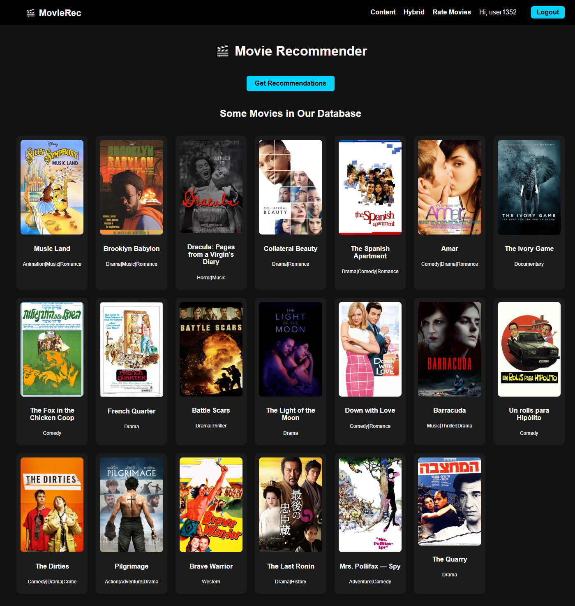
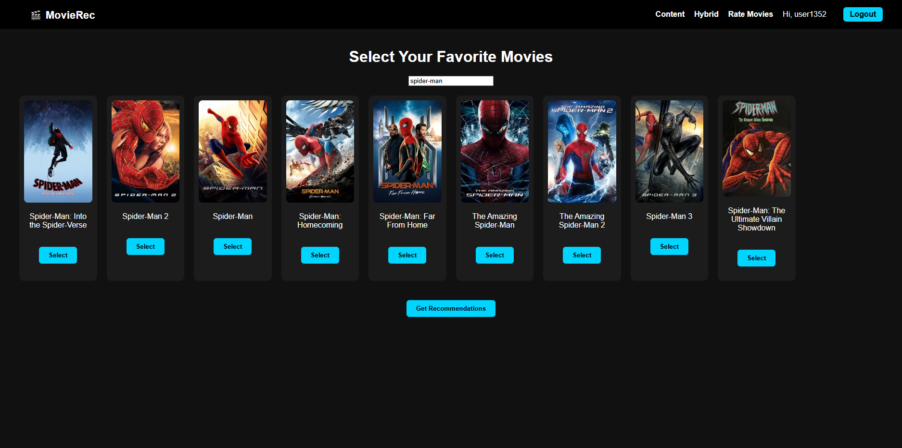
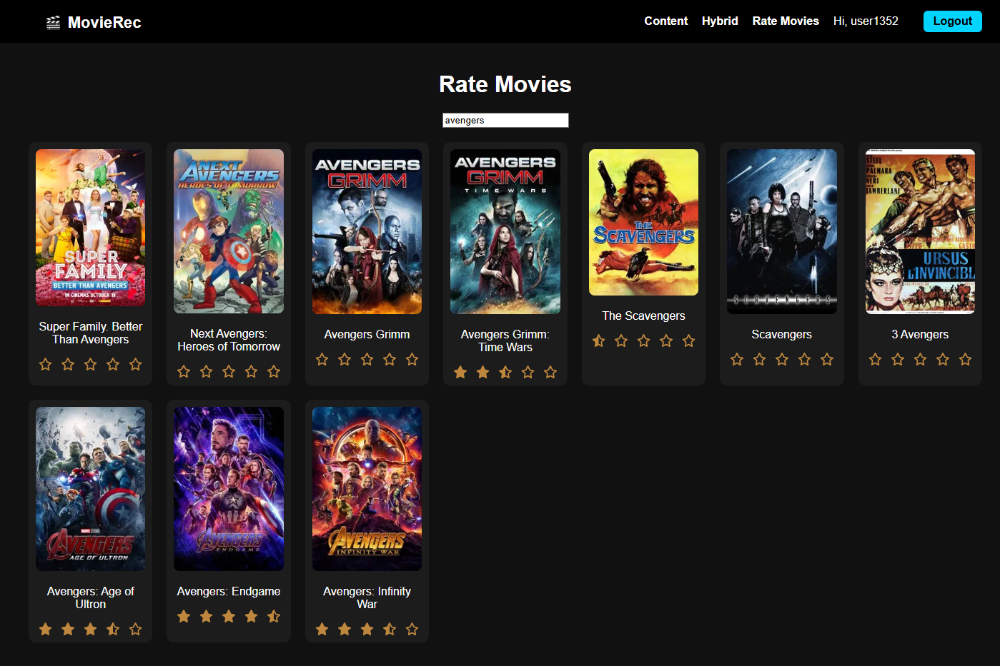
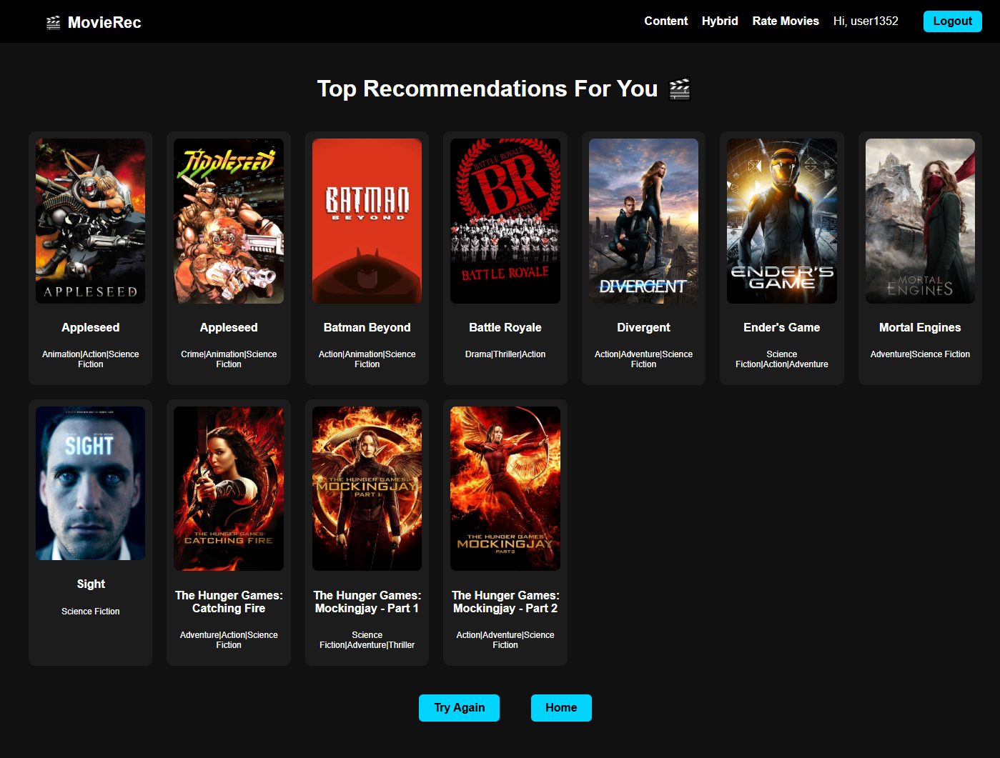

# ML Movie Recommender
A Django-based web application that recommends movies to users using a hybrid recommendation system combining content-based filtering and collaborative filtering. Users can search, rate movies, and receive personalized recommendations.

## Features

 - User Authentication: Users can register, login, and logout.
 - Content-Based Recommendations: Suggest movies similar to user’s favorite selections.
 - Hybrid Recommendations: Combine collaborative filtering (SVD) and content-based similarity for personalized recommendations.
 - Movie Search: Search movies by title in real-time.
 - Rate Movies: Rate movies from 0.5 to 5 stars.
 - Responsive UI: Grid layout with movie posters and interactive star ratings.
 - Saved Ratings: Ratings persist on account.

 ## App Showcase
 
 
 
 